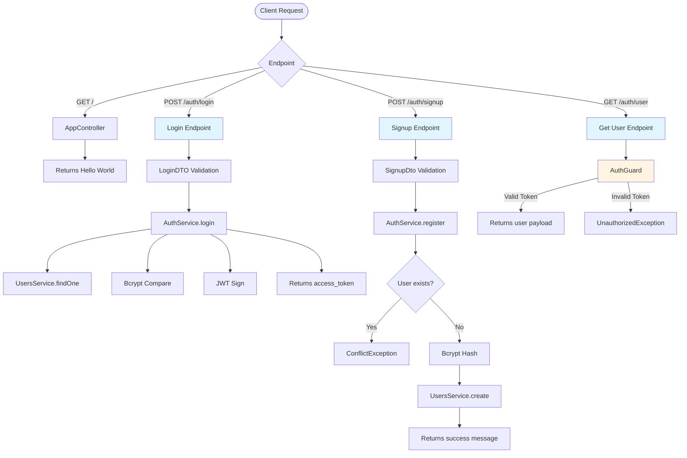

# EasyGenerator Auth App - Backend Documentation
---

## Overview

A NestJS-based authentication backend application that provides user registration, login, and token validation functionality. The application uses MongoDB for data persistence, JWT for authentication, and bcrypt for password hashing.

**Tech Stack:**
- **Framework:** NestJS 11.x
- **Database:** MongoDB with Mongoose
- **Authentication:** JWT (JSON Web Tokens)
- **Password Hashing:** bcrypt
- **Validation:** class-validator, class-transformer
- **Package Manager:** pnpm

---

## Project Structure

```
backend/
├── src/
│   ├── auth/                     # Authentication module
│   │   ├── dto/                  # Auth Data Transfer Objects
│   │   │   ├── login.dto.ts
│   │   │   └── signup.dto.ts
│   │   ├── auth.controller.ts    # Auth endpoints
│   │   ├── auth.service.ts       # Authentication business logic
│   │   ├── auth.module.ts        # Auth module definition
│   │   └── auth.guard.ts         # JWT authentication guard
│   │
│   ├── users/                    # Users module
│   │   ├── dto/                  # User Data Transfer Objects
│   │   ├── interfaces/           # TypeScript interfaces
│   │   ├── schemas/              # Mongoose schemas
│   │   ├── users.service.ts      # User business logic
│   │   └── users.module.ts       # Users module definition
│   │
│   ├── app.module.ts             # Root module
│   ├── app.controller.ts         # Root controller
│   ├── app.service.ts            # Root service
│   └── main.ts                   # Application entry point
│
├── test/                         # End-to-end tests
├── dist/                         # Compiled output
├── package.json
├── tsconfig.json
├── nest-cli.json
└── README.md

```

## Installation Guide

### Prerequisites
- **Node.js** (v18 or higher)
- **pnpm** (v8 or higher) - [Install pnpm](https://pnpm.io/installation)
- **MongoDB** (v6 or higher)
- Running locally or MongoDB Atlas connection string

### Installation

#### Local
Step 1: Install Dependencies
```
pnpm install
```

Step 2: Environment Configuration
```.env
PORT=3000
environ=dev

# MongoDB Configuration
MONGO_URI=mongodb://localhost:27017/easygenerator-auth

# JWT Configuration
secretKey=your-super-secret-jwt-key-change-this-in-production
saltRounds=10
```

Step 5: Run the Application
- Development mode: `pnpm run start:dev`
- Production mode: `pnpm run buildpnpm run start:prod`

### API Endpoints



# API Reference

## 1. Root Endpoint

### `GET /`

Returns a simple hello world message.

**Response**

```json
"Hello World!"
```

---

## 2. User Login

### `POST /auth/login`

Authenticates a user and returns a JWT access token.

### Request Body

```json
{
  "email": "user@example.com",
  "password": "SecurePass123!"
}
```

### Validation Rules

* **email**

  * Must be a valid email address
* **password**

  * Must be a non-empty string

### Success Response (200)

```json
{
  "access_token": "eyJhbGciOiJIUzI1NiIsInR5cCI6IkpXVCJ9..."
}
```

### Error Responses

* **401 Unauthorized** – Invalid email or password
* **400 Bad Request** – Validation errors

### Example

```bash
curl -X POST http://localhost:3000/auth/login \
  -H "Content-Type: application/json" \
  -d '{"email":"user@example.com","password":"SecurePass123!"}'
```

---

## 3. User Signup

### `POST /auth/signup`

Creates a new user account.

### Request Body

```json
{
  "displayName": "John Doe",
  "email": "john@example.com",
  "password": "SecurePass123!"
}
```

### Validation Rules

**displayName**

* Required
* String
* Minimum length: 3 characters

**email**

* Required
* Valid email format
* Must be unique

**password**

* Required
* String
* Minimum length: 8 characters
* Must contain:

  * At least one letter
  * At least one number
  * At least one special character

### Success Response (200)

```json
{
  "message": "User created successfully"
}
```

### Error Responses

* **409 Conflict** – User with email already exists
* **400 Bad Request** – Validation errors or creation failed

### Example

```bash
curl -X POST http://localhost:3000/auth/signup \
  -H "Content-Type: application/json" \
  -d '{
    "displayName": "John Doe",
    "email": "john@example.com",
    "password": "SecurePass123!"
  }'
```

---

## 4. Get Current User

### `GET /auth/user`

Returns the authenticated user's information from the JWT token.

### Headers

```
Authorization: Bearer <access_token>
```

### Success Response (200)

```json
{
  "displayName": "John Doe",
  "email": "john@example.com",
  "iat": 1234567890,
  "exp": 1234567920
}
```

### Error Responses

* **401 Unauthorized** – Missing or invalid token

### Example

```bash
curl -X GET http://localhost:3000/auth/user \
  -H "Authorization: Bearer YOUR_TOKEN_HERE"
```


# Environment Variables

| Variable   | Description               | Required | Default |
| ---------- | ------------------------- | -------- | ------- |
| PORT       | Server port               | No       | 3000    |
| environ    | Environment mode          | No       | -       |
| MONGO_URI  | MongoDB connection string | Yes      | -       |
| secretKey  | JWT secret key            | Yes      | -       |
| saltRounds | Bcrypt salt rounds        | No       | 10      |

### Example `.env`

```env
PORT=3000
environ=dev
MONGO_URI=mongodb://localhost:27017/easygenerator-auth
secretKey=your-super-secret-jwt-key-min-32-characters
saltRounds=10
```

---

# Database Schema

## User

```ts
{
  displayName: string;
  email: string;
  password: string;
}
```

**Mongoose Options**

* `timestamps: false`
* `versionKey: false`
* Unique index on `email`

---

# Authentication Flow

## Login Flow

1. Client sends `/auth/login`
2. DTO validation
3. User lookup
4. Password comparison
5. JWT signing
6. Token returned

---

## Signup Flow

1. Client sends `/auth/signup`
2. DTO validation
3. Email uniqueness check
4. Password hashing
5. User creation
6. Success response

---

## Protected Route Flow

1. Client sends JWT
2. AuthGuard validates token
3. Payload attached to request
4. Controller returns user info